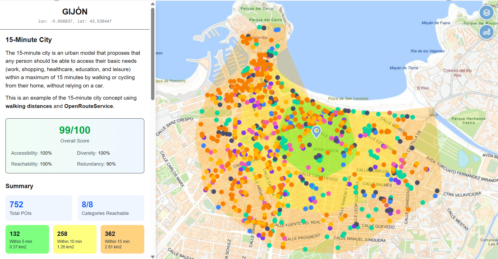

# 15MinuteCity

A modern Next.js app that visualizes the 15-minute city concept for Spain using geospatial accessibility data.

Live demo: https://15minutecity.vercel.app/



## What it does

- Shows a 15-minute city accessibility dashboard for selected map points.
- Uses POI and category statistics to compute a local accessibility score.
- Displays summary metrics such as:
  - Overall accessibility score
  - Diversity and reachability
  - Travel time counts for 5, 10 and 15 minute thresholds
  - Category group and top category breakdowns
- Converts map coordinates from Web Mercator (`EPSG:3857`) to geographic coordinates (`EPSG:4326`).
- Looks up the selected location name via reverse geocoding.

## Technologies

- **Next.js 16** (React 19)
- **TypeScript**
- **Tailwind CSS** for styling
- **Recharts** for charts and visual analytics
- **Turf** for geospatial utilities
- **API backends** with Next.js API routes

## Key features

- Interactive UI for exploring point-of-interest accessibility
- Responsive sidebar with charts and stat summaries
- Map-based coordinate selection and analysis
- Data-driven category scoring and metrics visualization

## Project structure

- `app/` – Next.js app routes and layout
- `src/components/POISideMenu.tsx` – dashboard panel with statistics
- `pages/api/` – OpenRouteService API endpoint for isochrones and POI's
- `public/` – static assets
- `src/types/` – global type declarations

## Run locally

```bash
npm install
npm run dev
```

Open http://localhost:3000 after starting the dev server.

## Build

```bash
npm run build
```

## Notes

This project is deployed on Vercel at https://15minutecity.vercel.app/.
